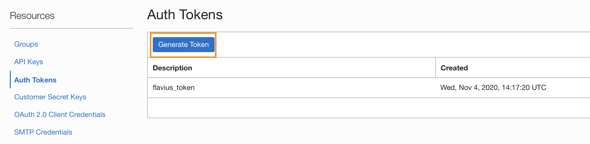
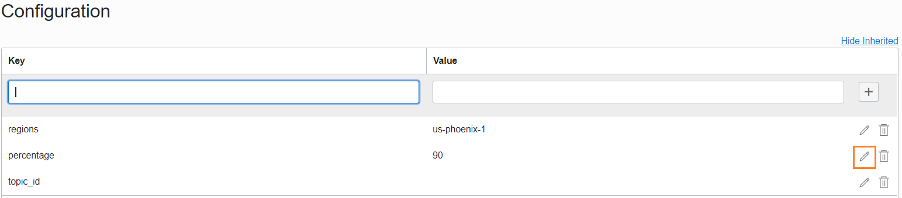

# Limit Monitoring

This code, wrapped in an Oracle function, will verify the limits for all of the available OCI components. 
If the total available resources is less than a percentage, the code will publish a message to a notification.

## Prerequisites
- Comparment
- Network (VCN / Subnet / IG / NAT)
- Oracle FN
- Docker
- A policy that let's the object storage service manage buckets should look like:
`Allow service objectstorage-us-ashburn-1 to manage object-family in Tenancy`

### Step1 - Install fn project
Before installing fn project, make sure you have docker up an running.

Go to you terminal.

- MacOS: `brew update && brew install fn`
- Linux / MacOS: `curl -LSs https://raw.githubusercontent.com/fnproject/cli/master/install | sh`

You can check more info [here](https://fnproject.io/tutorials/install/)


### Step2 - Creating an Auth Token
You will need to create an auth token.

In order to do so, you will have to go to your IAM user, select Auth Tokens and Generate Auth Tokens like below:


The auth token will shop up only once, so make sure you save it. This token will be the password used for logging it to the docker registry.


### Step 3 - Running the terraform code
The terraform code is used to prepare the scheduling part of the function and it is deploying:
- One Object Storage Bucket
- One Bucket LifeCycle Policy
- One Notification Topic (The fn will publish messages to this topic, if the limits are lower than the threshold)
- One Notification Subscription

The Object Storage Bucket has a lifecycle policy that deletes all objects after 7 days. Based on this policy, an event will trigger the function. 

For the first time, you will have to run the function manually or delete an object inside of this bucket. The function at the end of a run, will create an object inside the bucket and based on the delete policy mentioned above, it will run weekly.

Before diving into the code you will need to solve some dependencies:

### Installing Terraform

Go to [terraform.io](https://www.terraform.io/downloads.html) and download the proper package for your operating system and architecture. Terraform is distributed as a single binary. 
Install Terraform by unzipping it and moving it to a directory included in your system's PATH. You will need the latest version available.

### How to populate provider.auto.tfvars.

In order to prepare **provider.auto.tfvars** file, you will need the following:
- Tenancy OCID
- User OCID
- Local Path to your private oci api key
- Fingerprint of your public oci api key
- Region

#### Getting the Tenancy and User OCIDs

You will have to login to the [console](https://console.us-ashburn-1.oraclecloud.com) using your credentials (tenancy name, user name and password). If you do not know those, you will have to contact a tenancy administrator.

In order to obtain the tenancy ocid, after logging in, from the menu, select Administration -> Tenancy Details. The tenancy OCID, will be found under Tenancy information and it will be similar to **ocid1...."

In order to get the user ocid, after logging in, from the menu, select Identity -> Users. Find your user and click on it (you will need to have this page open for uploading the oci\_api\_public\_key). From this page, you can get the user OCID which will be similar to **ocid1...."


#### Creating the OCI API Key Pair and Upload it to your user page

Create an oci\_api\_key pair in order to authenticate to oci as specified in the [documentation](https://docs.cloud.oracle.com/en-us/iaas/Content/API/Concepts/apisigningkey.htm#How):

Create the .oci directory in the home of the current user

`$ mkdir ~/.oci`

Generate the oci api private key

`$ openssl genrsa -out ~/.oci/oci_api_key.pem 2048`

Make sure only the current user can access this key

`$ chmod go-rwx ~/.oci/oci_api_key.pem`

Generate the oci api public key from the private key

`$ openssl rsa -pubout -in ~/.oci/oci_api_key.pem -out ~/.oci/oci_api_key_public.pem`

You will have to upload the public key to the oci console for your user (go to your user page -> API Keys -> Add Public Key and paste the contents in there) in order to be able to do make API calls.

After uploading the public key, you can see its fingerprint into the console. You will need that fingerprint for your provider.auto.tfvars file. 
You can also get the fingerprint from running the following command on your local workstation by using your newly generated oci api private key.

`$ openssl rsa -pubout -outform DER -in ~/.oci/oci_api_key.pem | openssl md5 -c`


#### Getting the Region

Even though, you may know your region name, you will needs its identifier for the provider.auto.tfvars file (for example, US East Ashburn has us-ashburn-1 as its identifier).

In order to obtain your region identifier, you will need to Navigate in the OCI Console to Administration -> Region Management

Select the region you are interested in, and save the region identifier.


#### Prepare the provider.auto.tfvars file

You will have to modify the **provider.auto.tfvars** file to reflect the values that you’ve captured. 
The **provider_oci** map will have the following keys:
- **tenancy** (add your tenancy_id as the value)
- **user\_id** (add your user\_id as the value)
- **fingerprint** (add the fingerprint of the public **oci\_api\_key\_public.pem** you've generated and uploaded in the console to your user)
- **key\_file\_path** (add the local path to your private **oci\_api\_key.pem** key)
- **region** (add the region identifier)

In the end, your **provider.auto.tfvars** should look like this:
```
provider_oci = {
  tenancy       = "ocid1...."
  user_id       = "ocid1...."
  fingerprint   = "45:87:.."
  key_file_path = "/root/.oci/oci_api_key.pem"
  region        = "us-ashburn-1"
}
```

#### Dependencies:

Apart from the **provider.auto.tfvars**, there may be some other dependencies in the **terraform.tfvars** file that you will have to address:
- Compartment dependency
    - In order to be able to run the sample code, you will have to prepare a map variable (like in the **terraform.tfvars** file) called **compartment_ids**, which will hold key/value pairs with the names and ids of the compartments that you want to use.This variable will be external in order to offer multiple ways of linking them from a terraform perspective.
    ```
    compartment_ids = {
      sandbox = "ocid1...."
    }
    ```

- Application dependency
    - The application will need a subnet to reside in. You will need to prepare the map variable **subnet_ids** with the name and the subnet OCID of your choosing, and specify that name inside the variable **app_params** under **subnet_name**:

    ```
    subnet_ids = {
      hur1pub  = "ocid1.subnet.oc1.iad.aaa"
    }
    ```

    ```
    app_params = {
      thunder_app = {
        compartment_name = "sandbox"
        subnet_name      = ["hur1pub"]
        display_name     = "thunder_app"
        config = {
          "MY_FUNCTION_CONFIG" : "ConfVal"
        }
        freeform_tags = {
        }
      }
    }
    ```
- Subscription dependency
    - endpoint - Add the email that will receive limits notifications from the function
    ```
    subscription1 = {
      comp_name  = "sandbox"
      endpoint   = "test.test@oracle.com"
      protocol   = "EMAIL"
      topic_name = "topic1"
    }
    ```


#### Terraform parameters explained:

- Application parameters
    - compartment_name  - The compartment name in which the Event will be created
    - subnet_name       - Name of the subnet or subnets in which to run functions in the application
    - display_name      - Name of the application
    - config            - Values that are passed on to the function as environment variable.

- Bucket parameters
    - compartment_name  - The compartment name in which the Bucket will be created
    - name              - The name of the Bucket
    - access_type       - The type of public access on this Bucket
    - storage_tier      - The type of storage tier on this Bucket
    - events_enabled    - Whether or not events are emitted for object state changes in this bucket
    - kms_key_name      - The name of the KMS master key that will be used for encrypting the bucket. Empty string "" means that the KMS will not be used and the bucket will be encrypted using Oracle-managed keys

- Object lifecycle policy parameters
    - bucket_name - The name of the bucket to which the lifecycle policy will be applied
    - rule_name   - The name of the policy
    - is_enabled  - Whether or not the policy is enabled
    - action      - The type of action for this policy
    - time_amount - Specifies the age of objects to apply the rule to. This is interpreted in units defined by the time_unit parameter
    - time_unit   - The unit that should be used to interpret time_amount parameter

- Topic parameters
    - comp_name   - The compartment name in which the Topic will be created
    - topic_name  - The name of the Topic
    - description - The description of the Topic

- Subscription parameters
    - comp_name - The compartment name in which the Subscription will be created
    - endpoint  - A locator that corresponds to the subscription protocol
    - protocol  - The protocol used for the subscription
    - topic_name - The name of the Topic the subscription is applied to


Run the terraform code

Go to the terraform directory.
```
$ terraform init
$ terraform plan
$ terraform apply
```

You will need to save the topic_id, app_name and bucket_name exported as outputs from terraform, because you will need those in the next step.


## Automatic deployment (one function per region with a main function that runs all)
### Step4 - Run the deployment.py automation
Go to serverless -> deployment.

The **deployment.py** utility will deploy one function per region (only the subscribed regions will be in effect), a main function that will run all the other functions and an event that will trigger the main function.

All of the functions and the event will be actually deployed in the home region and from there, limits will be checked for all the subscribed regions.

The script has a couple of args that you will have to provide.

```
$ python3.9 deployment.py --help
usage: deployment.py [-h] -user USER -password PASSWORD -compartment_id COMPARTMENT_ID -app_name APP_NAME -topic_id TOPIC_ID -percentage PERCENTAGE -bucket_name BUCKET_NAME -fn_prefix FN_PREFIX

Creates the limits functions for all of the regions

optional arguments:
  -h, --help            show this help message and exit
  -user USER            The user used for connecting to the docker registry. tenancy_namespace\user_email or tenancy_namespace\federation_client\user_email
  -password PASSWORD    The auth token value used for logging in to the docker registry
  -compartment_id COMPARTMENT_ID
                        The comp id in which the functions will be created
  -app_name APP_NAME    The name of the app in which the functions will be created
  -topic_id TOPIC_ID    The id of the topic used for publishing limit messages
  -percentage PERCENTAGE
                        The threshold percentage
  -bucket_name BUCKET_NAME
                        The name of the bucket used by the main function
  -fn_prefix FN_PREFIX
                        The prefix you want to use for your function names
```

The **user** and **password** args are used for connecting to the docker registry. 

The **user** should be preceeded by the tenancy_namespace and if your user is federated, it should also have the federation client in the name.

For a tenancy having the namespace myawesometenancy, using oracle identity cloud service, for a user called myawesomeuser the user will be:

`myawesometenancy\oracleidentitycloudservice\myawesomeuser`

The **password** is the auth token created at Step3. Put it in ''.

**compartment_id** will be the id of the compartment in which the functions will be created.

**app_name** is the name of the application in which the functions will be created

**topic_id** is the id of the topic used for publishing the limits

**percentage** the threshold of the limit checks

**bucket_name** the name of the bucket used for scheduling the functions.

**fn_prefix** the prefix of the functions


Example run:
```
python3.9 deployment.py -user  myawesometenancy\oracleidentitycloudservice\myawesomeuser -password '' -compartment_id ocid1.compartment.oc1.. -app_name test2 -topic_id ocid1.onstopic.oc1.iad. -percentage 90 -bucket_name name_of_the_bucket -fn_prefix name_prefix_of_functions
```

After this finishes, you will have everything up and running.


## Manual deployment of the function
### Step5 - Prepare the context
After you make sure you have fn project installed, you are now ready to deploy your function.

In order to do so, you must first prepare the context. In your terminal run:

`fn create context context_name --provider oracle` - The name can be anything of your choosing

`fn use context context_name`

`fn update context oracle.compartment-id your_compartment_id` - The compartment id, should be the compartment in which you've created the FN Application.

`fn update context api-url https://functions.region.oci.oraclecloud.com` - For ashburn, the api-url will be: `https://functions.us-ashburn-1.oci.oraclecloud.com`

`fn update context registry region_identifier.ocir.io/tenancy_namespace/name_of_your_registry` - For a tenancy named abcd in the ashburn region for a registry named my_registry (this can be anything) this will translate to: `iad.ocir.io/abcd/my_registry`


### Step6 - Docker Registry Login
In order to login to the ashburn docker registry, you will have to run the following command, in your terminal:

`docker login iad.ocir.io`

When prompted for your user, make sure you also add the tenancy namespace before the user name.
E.G. If your user is test@test.com and the tenancy namespace is abcd your user will be: `abcd/test@test.com`.

When prompted for your password, use the auth token generated above.

You should now receive a message that you are successfully loged in to the registry.


### Step7 - Deploying the function
After completing all the steps from above, you are now ready to deploy the function.
In order to do that, you must first make sure that you are in the **main** directory.

You can do so, by running the following command in your terminal: `fn deploy --app name_of_the_app` - The app name will be the one created in terraform


### Step8 - Configuration variables
Each function has 3 configuration variables:
- regions - The region in which the function will run
- percentage - Should be a number between 1-100. Based on this number, you will receive alerts for your functions
- topic_id - The notification topic id that you will use in order to publish messages

If you want a different treshold for a region, you can change the percentage for the function from that region.
In order to do so, go to applications -> select the created app from step3 -> select the function for the region that you want(the name should be the fn_prefix_region_key, example **prefix_phx**) -> go to configuration and click on the edit button next to percentage.



### Step9 - Invoking the function
Go back to your terminal in the function directory.

By running `fn -v invoke app_name function_name`, you will be able to invoke the function.

The `app_name` is the name of the app created with terraform 

The `function_name` is the main function deployed in step4.

After 30 seconds to 2 minutes, the function should've ran completelly. 
If the limits have been reached in any regions, you should be notified via the subscriptions you've created with the terraform code.
